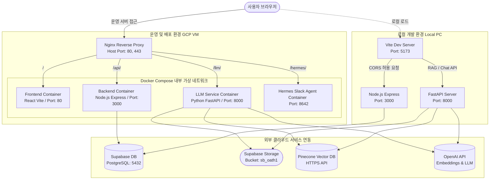
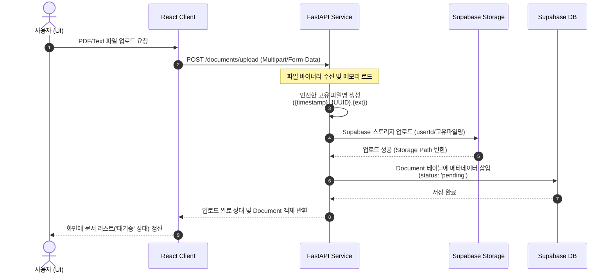
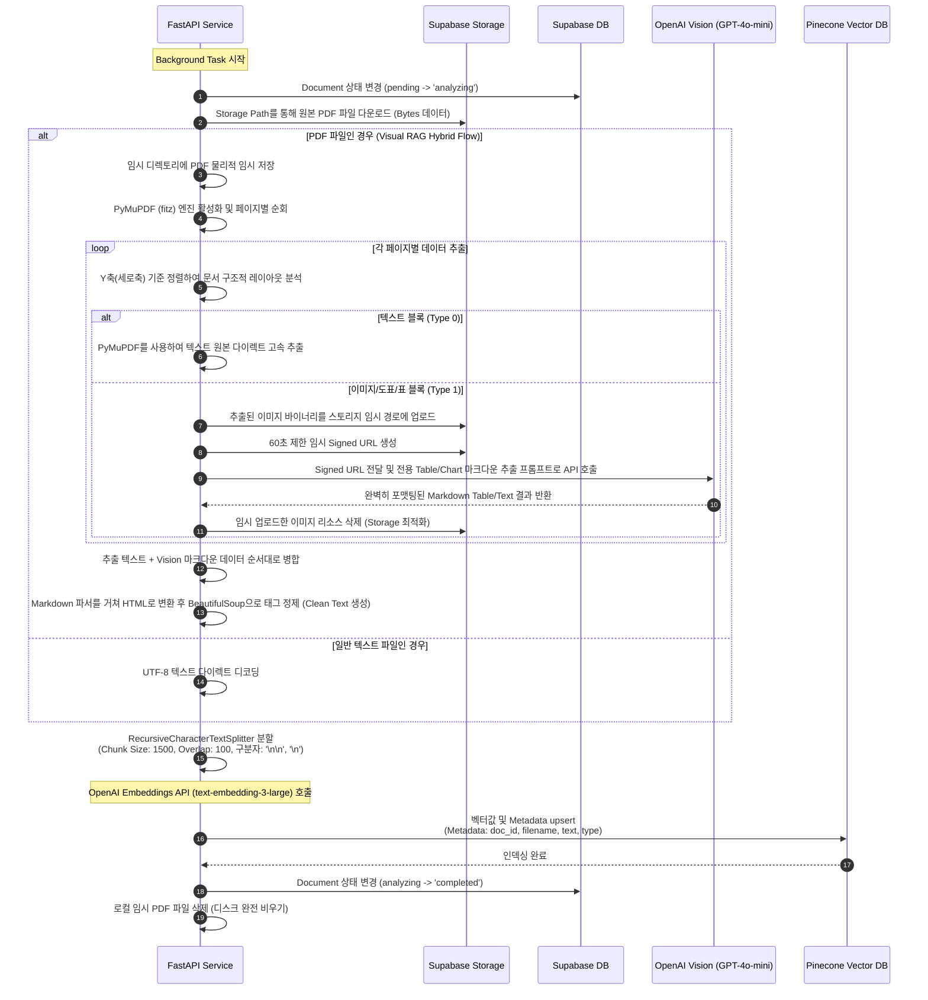
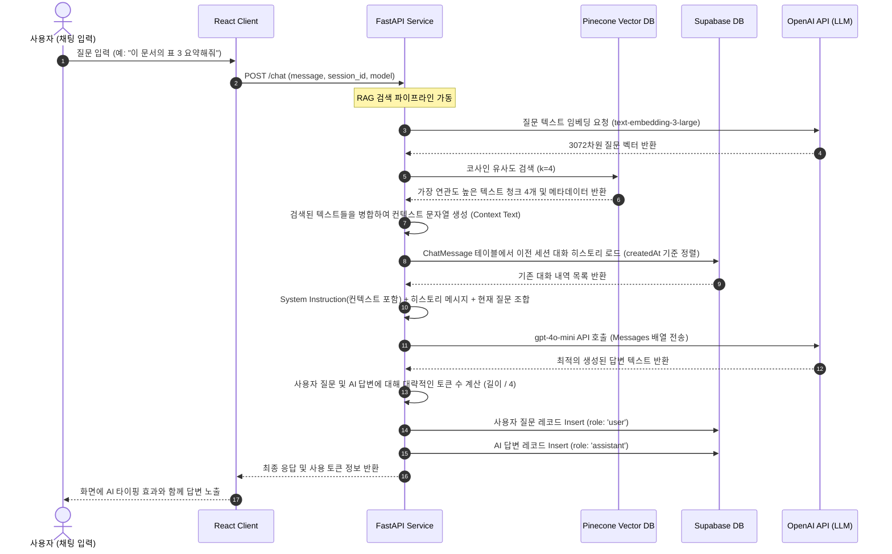

# RobinRag 프로젝트 아키텍처 및 상세 파이프라인 가이드

이 문서는 RobinRag 프로젝트의 전체 시스템 구조(개발 및 운영 환경), 사용 기술스택, 포트 매핑 구조, 그리고 데이터의 라이프사이클(파일 업로드 -> 분석 -> RAG 검색 -> LLM 응답)에 이르는 구체적인 기술 워크플로우를 정리한 종합 기술 가이드라인입니다.

---

## 1. 시스템 아키텍처 및 환경별 구성 (Architecture & Environments)

RobinRag 시스템은 목적에 따라 **로컬 개발 환경(Development)**과 **운영/배포 환경(Production)**으로 분리하여 인프라를 운영합니다. Nginx 리버스 프록시를 통해 호스트의 외부 노출 영역을 최소화하고 내부 컨테이너들을 격리합니다.



### 1.1 환경별 포트 구성 및 역할
#### A. 로컬 개발 환경 (Local Development)
- **Vite 개발 서버 (`5173`)**: HMR(Hot Module Replacement) 기능이 내장되어 프론트엔드 변경 사항을 로컬 웹 브라우저에 실시간 반영합니다.
- **Express 백엔드 (`3000`)**: 로컬 브라우저(`localhost:5173`)에서 전송되는 비동기 API 요청을 받아들이기 위해 CORS 정책이 허용된 상태로 동작합니다.
- **FastAPI LLM 서비스 (`8000`)**: 로컬 호스트 터미널에서 구동되어 RAG 및 임베딩 로직을 로컬 테스트할 수 있는 엔드포인트를 제공합니다.

#### B. 운영/배포 환경 (Production - Docker Compose)
- **외부 노출 포트 (Host Port)**
  - **`80` (HTTP)**: Let's Encrypt 인증(ACME Challenge) 검증을 처리하며, 일반 사용자 접근은 `443` HTTPS 보안 포트로 강제 리다이렉트합니다.
  - **`443` (HTTPS)**: 호스트의 유일한 노출 포트로, SSL 인증서를 종단(Terminate)하고 서브 경로에 따라 내부 격리 컨테이너로 리버스 프록시를 수행합니다.
- **내부 격리 포트 (Container Port, 호스트 직접 노출 차단)**
  - **`client:80`**: React Vite 웹 리소스 서빙 포트입니다. Nginx가 루트 경로(`/`) 요청을 받아 처리합니다.
  - **`server:3000`**: 백엔드 API 서비스 포트입니다. Nginx가 `/api/` 요청을 받아 내부의 3000 포트로 라우팅합니다.
  - **`llm_service:8000`**: RAG 비동기 처리 파이프라인 포트입니다. Nginx가 `/llm/` 경로를 포트 8000으로 매핑합니다.
  - **`hermes:8642`**: 슬랙 에이전트 대시보드 포트입니다. Nginx가 `/hermes/` 경로를 포트 8642로 래핑하여 프록시 전달합니다.

---

## 2. 상세 데이터 파이프라인 (Data Pipeline Workflows)

### 2.1 파일 업로드 파이프라인 (File Upload)
사용자가 파일을 드래그 앤 드롭하여 업로드할 때, 해당 리소스가 스토리지에 격리 저장되고 상태가 기록되는 흐름입니다.


---

### 2.2 하이브리드 문서 분석 및 인덱싱 파이프라인 (Analysis, Chunking & Embedding)
사용자가 **"Analyze"** 버튼을 눌렀을 때 백그라운드 태스크(FastAPI `BackgroundTasks`)로 수행되는 텍스트/이미지 하이브리드 비주얼 RAG 추출 및 인덱싱 프로세스입니다.


---

### 2.3 RAG 검색 및 LLM 응답 생성 파이프라인 (RAG & LLM Inference)
질문에 적합한 지식을 유사도 기준으로 탐색하여 대화 컨텍스트와 함께 모델에 주입하는 단계입니다.


---

## 3. 핵심 자동화 및 예방 로직 상세

### 3.1 Supabase 비활성화 방지 (Keep-Alive Cron)
Supabase 프리티어의 1주일 무활동 비활성화 정책을 예방하기 위해 이중화된 자동 연동이 스케줄링되어 실행됩니다.

1. **REST API Keep-Alive (기본)**:
   - 백엔드 컨테이너 내부에서 `node-cron` 스케줄러가 **매 6시간마다(`0 */6 * * *`)** 동작합니다.
   - 외부의 Supabase API REST 엔드포인트(`https://<project-id>.supabase.co/rest/v1/`)로 HTTP GET 요청을 날려 세션을 강제 유지합니다.
2. **Database Query Keep-Alive (Fallback)**:
   - 만약 REST 정보 누락 또는 HTTP 에러 발생 시, Prisma ORM을 사용해 데이터베이스 인스턴스에 직접 `SELECT 1` SQL 쿼리를 실행하여 커넥션 풀을 활성 상태로 갱신합니다.

---

### 3.2 SSL 인증서 자동 갱신 및 Nginx 결합 구조
Let's Encrypt 인증서의 90일 만료 기한을 우회하기 위해 Certbot 컨테이너를 함께 구동하여 무중단 갱신을 수행합니다.
- Nginx와 Certbot 컨테이너가 `/etc/letsencrypt` 및 `/var/www/certbot` 디렉토리를 **공유 볼륨**으로 연계하여 참조합니다.
- Certbot은 12시간마다 `renew` 여부를 자동 검사합니다.
- 갱신이 완료된 인증서의 실제 적용을 보장하기 위해 매월 1일 새벽 3시에 Nginx를 재부팅하는 VM Host 크론탭이 보조 가동됩니다.

---

## 4. Hermes Slack Agent 독립 실행 및 연동 가이드

RobinRag 프로젝트와 결합도(Coupling)를 낮추고, 대시보드 및 서비스 생명주기를 완벽히 분리하기 위해 **Hermes Agent를 독립된 별도의 Docker 컨테이너로 실행**하고 Nginx와 동일 가상 네트워크로 통신하게 설정합니다.

### 4.1 `docker-compose.yml` 네트워크 환경설정
Nginx가 독립 컨테이너인 Hermes의 DNS(`http://hermes:8642`)를 분석할 수 있도록, RobinRag docker-compose 스택에 명시적인 공용 가상 네트워크인 **`robinrag_network`**를 지정합니다.
```yaml
# docker-compose.yml 예시 (하단에 정의)
services:
  nginx:
    # ...
    # Nginx가 robinrag_network 기본 네트워크를 사용하므로
    # 동일 네트워크에 소속된 hermes 컨테이너에 이름으로 통신 가능

networks:
  default:
    name: robinrag_network
```

### 4.2 Hermes 독립 컨테이너 구동 명령어
호스트 VM 터미널에서 다음 명령어를 실행하여 Hermes 컨테이너를 `robinrag_network`망에 직접 소속시켜 구동합니다.
```bash
sudo docker run -d \
  --name hermes \
  --network robinrag_network \
  --restart always \
  -v ~/hermes_data:/opt/data \
  nousresearch/hermes-agent:latest
```

### 4.3 `nginx/default.conf` 프록시 라우팅 추가
Nginx 443 SSL 가상 서버 블록 하단에 WebSocket 및 로그 스트리밍을 수용하는 프록시 설정을 추가하고 Nginx를 리스타트합니다.
```nginx
    # Hermes Agent 관리자 대시보드 프록시 맵핑
    location /hermes/ {
        proxy_pass http://hermes:8642/; # 뒤에 슬래시(/) 필수
        proxy_set_header Host $host;
        proxy_set_header X-Real-IP $remote_addr;
        proxy_set_header X-Forwarded-For $proxy_add_x_forwarded_for;
        proxy_set_header X-Forwarded-Proto $scheme;
        
        # 실시간 스트리밍 및 웹소켓 지원 (대시보드 필수)
        proxy_http_version 1.1;
        proxy_set_header Upgrade $http_upgrade;
        proxy_set_header Connection "upgrade";
    }
```

### 4.4 Hermes Custom Tool 등록 설정 (RAG 연동)
Hermes 대시보드(`https://robinrag.duckdns.org/hermes/`)에 로그인하여 Custom Tool을 아래와 같이 등록하여 슬랙 비서가 Pinecone 지식을 활용하게 설정합니다.

- **Tool Name**: `search_robinrag_knowledge`
- **Method**: `POST`
- **URL**: `http://llm_service:8000/chat` (동일 네트워크이므로 llm_service 호스트 명칭으로 직통 통신)
- **Arguments (JSON)**:
  ```json
  {
    "message": "{{user_prompt}}",
    "session_id": "hermes-slack-session",
    "model": "gpt-4o-mini"
  }
  ```
  *(FastAPI 엔드포인트 파라미터 규격에 맞춰 `model` 키를 명확히 매핑합니다.)*
